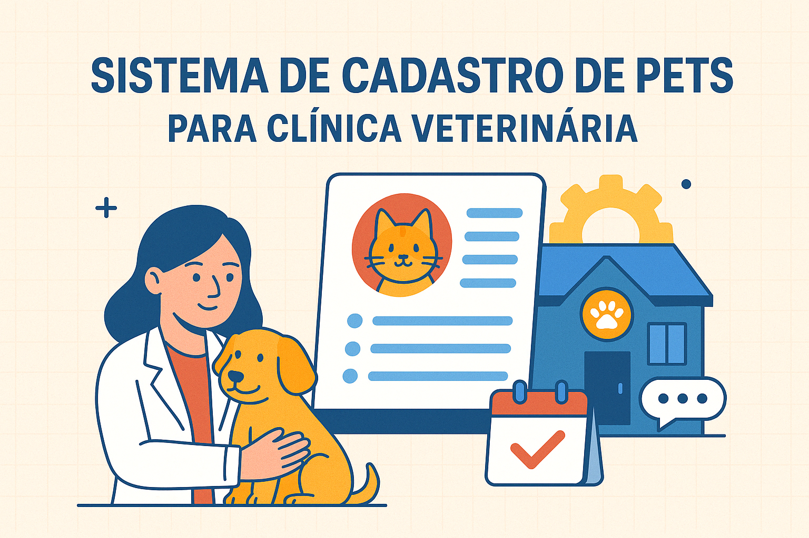

# 🐶 Sistema de Cadastro de Pets para Clínica Veterinária



[](https://choosealicense.com/licenses/mit/)

[](https://laravel.com/)


📋 Um sistema simples, direto ao ponto, para clínicas que amam cuidar bem dos seus pets e clientes.

---

## 📖 Sobre

Este projeto é um mini sistema de gerenciamento de pets desenvolvido com Laravel, focado em ser enxuto e eficiente. Ideal para clínicas veterinárias que desejam registrar dados de clientes, pets e atendimentos com rapidez e organização.

---

## ✨ Funcionalidades Principais

- 📇 Cadastro de Clientes: nome, telefone, e-mail, CPF, endereço, etc.
- 🐾 Cadastro de Pets: nome, idade, espécie, raça, peso, etc.
- 🩺 Registro de Atendimentos: descrição do serviço, data, observações.
- 🔗 Associação entre clientes e seus respectivos pets.
- 🕑 Histórico de atendimentos e agendamentos.

---

## ⚙️ Passo a Passo de Instalação

Antes de começar, verifique se possui:

- [PHP 8.4 ou superior](https://www.php.net/downloads.php)
- [Docker](https://www.docker.com/get-started)
- [Composer](https://getcomposer.org/)
- [Laravel Sail](https://laravel.com/docs/12.x/sail)

1. Clone o repositório:

```bash
git clone https://github.com/ViniciusBelem/app_2a.git
cd app_2a
```

2. Suba o ambiente com o Sail:

```bash
./vendor/bin/sail up -d
```

3. Configure seu arquivo .env com os dados do banco:

```env
DB_CONNECTION=mysql
DB_HOST=127.0.0.1
DB_PORT=3306
DB_DATABASE=nome_do_banco
DB_USERNAME=root
DB_PASSWORD=
```

4. Rode as migrations:

```bash
./vendor/bin/sail artisan migrate
```

5. (Opcional) Popule o banco com dados fictícios:

```bash
./vendor/bin/sail artisan db:seed
```

6. Acesse a aplicação:

```
http://localhost
```

---

## 🙏 Agradecimentos

Este projeto foi inspirado em necessidades reais de clínicas veterinárias. Agradeço à comunidade Laravel e aos mantenedores das bibliotecas utilizadas por sua dedicação e qualidade.

---

## 📬 Contato

💬 Dúvidas, sugestões ou colaborações? Fique à vontade para entrar em contato com nossa equipe:

- 👩‍💼 Gestora do Projeto & Responsável pelo Repositório:
  - Nome: Vinicius Azevedo da Silva Belem
  - E-mail: [vinicius.belem@estudante.ifto.edu.br]

- 👨‍💻 Desenvolvedor Back-End:
  - Nome: Carlos Eduardo Santos de Sousa
  - E-mail: [carlos.sousa20@estudante.ifto.edu.br]

- 🎨 Desenvolvedor Front-End:
  - Nome: Rhuan Pablo Mendes de Sousa
  - E-mail: [rhuan.sousa2@estudante.ifto.edu.br]

---
